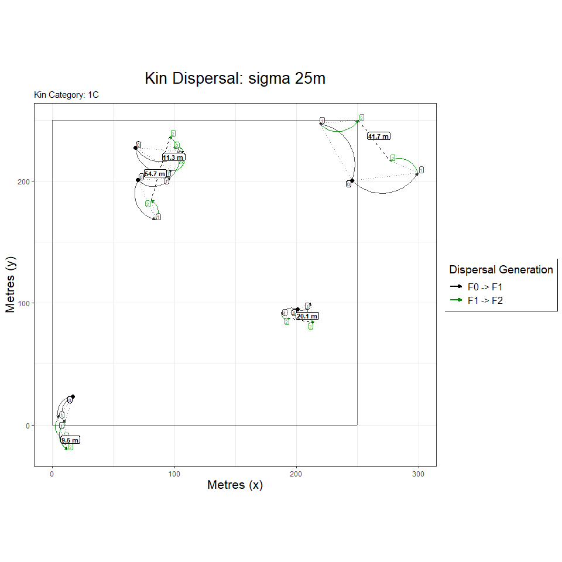
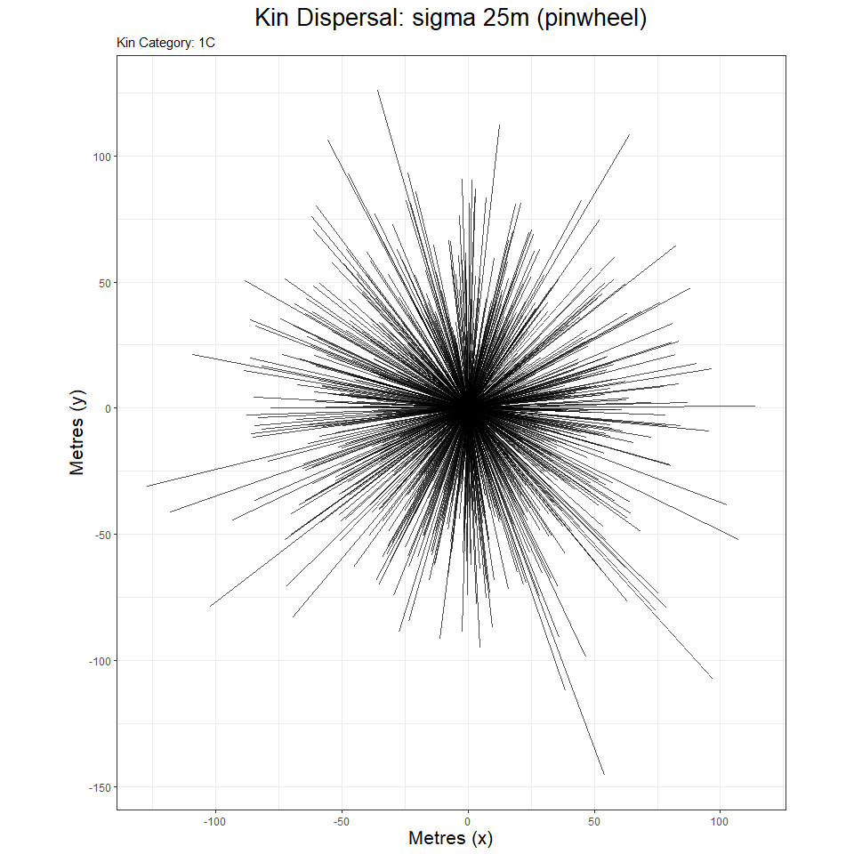

KINDISPERSE 0.9.2
================

-   [1. Introduction](#1-introduction)
-   [2. Installation](#2-installation)
-   [3. The shiny app](#3-the-shiny-app)
    -   [3.1 Running the app](#31-running-the-app)
    -   [3.2 External interface](#32-external-interface)
-   [4. The R package](#4-the-r-package)
    -   [4.1 Simulations and Sampling](#41-simulations-and-sampling)
    -   [4.2 Data Management](#42-data-management)
    -   [4.3 Estimating dispersal](#43-estimating-dispersal)

<!-- README.md is generated from README.Rmd. Please edit that file -->
<!-- badges: start -->
<!-- badges: end -->

The goal of kindisperse is to simulate and estimate close-kin dispersal
kernels.

# 1. Introduction

Dispersal is a key evolutionary process that connects organisms in space
and time. Assessing the dispersal of organisms within an area is an
important component of estimating risks from invasive species, planning
pest management operations, and evaluating conservation strategies for
threatened species.

Assessing the dispersal of small, abundant and short-lived animals such
as insects has traditionally been more difficult than for animals that
can be easily tagged. Responding to this challenge, researchers have
developed various methods based around mark-release-recapture that mark
the organisms with dyes, paint, or chemical tags, before releasing the
individuals and in various ways measuring the number of recaptures.

Such methods suffer the limitations of requiring manipulation of the
same individuals in which dispersal is being assessed, are
labour-intensive when conducted across a large enough area to be
informative, and typically are not estimates of true intergenerational
dispersal (which is measured life-stage to life-stage, e.g. from the egg
of the parent to the egg of its offspring). Such life-stage to
life-stage estimates are important as they are readily interpretable
within established intergenerational analytic frameworks such as
Wright’s neighbourhood size.

Leveraging decreases in sequencing costs, out new method instead
estimates dispersal from the spatial distribution of close-kin. This
method requires that close kin dyads be identified and scored for two
variables: (i) the geographical distance between the two individuals in
the dyad, and (ii) their estimated order of kinship (1st order
e.g. full-sib; 2nd order e.g. half-sib; 3rd order e.g. first cousin).

Close-kin-based dispersal can provide an estimate of the
intergenerational (or parent-offspring) dispersal kernel - a key factor
that connects biological events across the lifespan of an organism with
broader demographic and population-genetic processes such as isolation
by distance. A dispersal kernel is the probability density function
describing the distributions of the locations of dispersed individuals
relative to the source point. Intergenerational dispersal kernels
themselves can be framed in terms of any number of breeding and
dispersal processes, defined by both reference life-stage and number of
generations, and leave their mark in the spatial distribution of various
categories of close kin, which can be treated as samplings from a set of
underlying kernels. Actual kernels vary, but are typically described in
terms of sigma, the second moment of the kernel, also known as its scale
parameter. More complex kernels can also incorporate a parameter for
shape or kurtosis (kappa), representing the fourth moment of the kernel.

In the case of an insect like the mosquito, the most basic
intergenerational kernel, the lifespan or parent-offspring kernel,
reflects all dispersal and breeding processes connecting (e.g.) the
immature (egg, larval, pupal) location of a parent to the immature
location of its offspring. However, this kernel can be combined with
additional breeding, dispersal and sampling events to produce other,
composite dispersal or distribution kernels that contain information
about intergenerational dispersal. For example, the distribution of two
immature full-sibling mosquitoes reflects not a full lifespan of
dispersal, but two ‘draws’ from the component kernel associated with the
mother’s ovipositing behaviour. Were we to sample the same full-sibling
females as ovipositing adults, this would instead represent two draws
from a composite ‘lifespan and additional oviposition’ kernel. Avuncular
larvae, should they exist, would represent draws from related but
distinct intergenerational dispersal kernels - an oviposition kernel,
and a composite ‘oviposition and lifespan’ kernel. The avuncular
distribution kernel would thus reflect a further compositing of these
dispersal events.

There is a rich literature examining the kernels of basic dispersal
events, and analysing them in terms of various kernel functions, whether
Gaussian, exponential, or others with differing properties and shapes,
often reflecting the tendency of dispersal events to be
disproportionately clustered around the source and/or be dispersed at
great distances from the source (i.e. for the kernel to be fat-tailed).
Most of this literature explores dispersal in terms of probability of a
dispersed sample being at a certain radius from the dispersed source. In
the case of close-kin recaptures of e.g. first cousins, we are instead
presented with dispersal events that must be approached in two
dimensions with respect to both radius of dispersal and additionally
angle of dispersal. A successful estimator of intergenerational
dispersal using close-kin recaptures must find strategies to decompose
the extraneous spatial and breeding components affecting the kernels,
and ultimately re-express dispersal in terms of an axial sigma - that
aspect of dispersal which operates within one dimension across a
two-dimensional space. This is the sigma component relied upon by
[Wright (1946)](https://www.ncbi.nlm.nih.gov/pmc/articles/PMC1209315/)
for isolation by distance , and which is reflected in estimations of
neighbourhood area.

The method we have developed relies upon the fact that different kinship
categories reflect different but related underlying intergenerational
dispersal composites, and uses the relationships between these kinship
distribution kernels to extract information about the core
parent-offspring dispersal kernel that produced the derivative kernels.
For example, the immature distribution kernel of full siblings differs
from the immature distribution of first cousins by a single lifespan:
using an additive variance framework, the first cousin variance that is
not accounted for by subtracting the full sibling variance constitutes
an estimate of the parent-offspring distribution, from which an
intergenerational kernel estimate can be derived. This is because both
immature full-sibling and immature first cousins are ‘phased’ with
respect to the organisms’ life cycle - that is, they are separated by an
integer multiple of parent-offspring dispersal events. It is this
phasing that enables the extraction of a ‘pure’ effective dispersal
estimate, via the additive property of variance. Other examples of
phased relationships include half sibling immatures to half cousin
immatures (one cycle), full sibling immatures to second cousin immatures
(two cycles), or even (for mosquitoes) full sibling immatures to second
cousin ovipositing adults (three cycles).

Further details can be found in [Jasper et
al. (2019)](https://doi.org/10.1111/1755-0998.13043) “A genomic approach
to inferring kinship reveals limited intergenerational dispersal in the
yellow fever mosquito”.

This package supplements these papers by supplying methods for (a)
importing and exporting information about distances & kinship
relationships for pairs of individuals, (b) estimating the axial
distribution (axial sigma for dispersal or position distributions) from
empirical distributions of kin-pairs, and (c) estimating the
intergenerational (parent-offspring) dispersal distribution (axial
sigma) that underlies the distributions of multiple phased kin
categories. This package also implements several simulation tools for
further exploring and testing the properties of intergenerational
dispersal kernels, as well as to assist in designing experiment layouts
& sampling schemes. Finally, for ease of use, the package supplies an
integrated shiny app which also implements the vast majority of package
functionality in a user-friendly interface.

# 2. Installation

You can install the released version of kindisperse from
[CRAN](https://CRAN.R-project.org) with: (in future. this doesn’t
currently exist)

``` r
install.packages("kindisperse")
```

And the development version from [GitHub](https://github.com/) with:

``` r
# install.packages("devtools")
devtools::install_github("moshejasper/kindisperse")
```

Once installed, load the package as follows:

``` r
library(kindisperse)
#> kindisperse 0.9.1
```

# 3. The shiny app

The kindisperse app bundles most of the tools supplied in this package
for ease of use.

## 3.1 Running the app

To run the app, enter the function `run_kindisperse()` and in a moment
the app will appear in a separate window. To close, exit this window, or
alternatively hit the ‘stop’ button or equivalent in RStudio.

## 3.2 External interface

To calculate axial values, etc. of objects within the app, they first
must be passed to the app from the computer or the R package
environment. One option is to save objects to the computer via either
.csv or .kindata formats, then load them using the in-app interface.

Alternatively, objects you have loaded or created in the R package
environment can be passed to the app by first mounting them to the
special `appdata` environment which can be accessed from within the app
via the `Load` tab. Mounted objects must be of class `KinPairData` or
`KinPairSimulation`. To mount an object, use the
`mount_appdata(obj, "nm")` function (unmount with
`unmount_appdata("nm")`). The `appdata` environment can be viewed with
`display_appdata()` and cleared with `reset_appdata()`. Objects mounted
to appdata from within the app can also be retrieved with
`retrieve_appdata()` or `retrieveall_appdata()`.

``` r
fullsibs <- simulate_kindist_composite(nsims = 100, ovisigma = 25, kinship = "FS")
reset_appdata()
mount_appdata(fullsibs, "fullsibs")
display_appdata()
#> <environment: kindisperse_appdata>
#> parent: <environment: namespace:kindisperse>
#> bindings:
#>  * fullsibs: <KnPrSmlt>
fullsibs2 <- retrieve_appdata("fullsibs")
reset_appdata()
```

The app also uses a temporary environment for in-app data handling and
storage. Following a session, objects stored in this space can be
bulk-accessed via the function `retrieve_tempdata()`, and reset via the
function `reset_tempdata()`.

# 4. The R package

Package functions and typical usage are introduced below

## 4.1 Simulations and Sampling

KINDISPERSE is is built to run three types of simulation. The first is a
graphical simulation showing the dispersal of close kin over several
generations. The second and third are both simulations of close kin
dyads, one using a simple PO kernel, the other a composite one. The
package also includes one subsampling function to assist in using these
simulations for field study design.

### 4.1.1 Graphical simulations

This is designed primarily for introducing, exploring, and easily
visualising dispersal concepts. It is packaged in two parallel
functions: the simulation function (`simgraph_data()`) and the
visualisation function(`simgraph_graph()`). A standard example of their
use is shown below, in this case, modeling families including first
cousins with a kernel sigma of 25m, and site dimensions of 250x250m. The
first graph shows the dispersal events leading to first cousins within
five of these families.

``` r
## run graphical simulation
graphdata <- simgraph_data(nsims = 1000, posigma = 25, dims = 250)
simgraph_graph(graphdata, nsim = 5, kinship = "1C")
```



However, the options of both can be tweaked to show other data types,
e.g. a pinwheel graph focused on 1,000 first cousin dyads.

``` r
graphdata <- simgraph_data(nsims = 1000, posigma = 25, dims = 250)
simgraph_graph(graphdata, nsims = 1000, pinwheel = T, kinship = "1C")
```



or a histogram of first cousin dyads:

``` r
graphdata <- simgraph_data(nsims = 1000, posigma = 25, dims = 250)
simgraph_graph(graphdata, nsims = 1000, histogram = T, kinship = "1C")
```


The simgraph functions are also implemented in the ‘Tutorial’ tab of the
kindisperse app.

### 4.1.2 Kinpair Simulations

These are designed for simulating and testing the impacts of various
dispersal and sampling parameters on a dataset, and for testing and
validating the estimation functions. They return an object of class
KinPairSimulation, which supplies a tibble (dataframe) of simulation
results, as well as metadata capturing the simulation parameters.

Three kernel types are supported for the next two simulations at
present: `Gaussian`, `Laplace`, and `vgamma` (variance-gamma). These are
passed to the functions with the `method` parameter. If using vgamma,
also supply its shape parameter with the argument `shape`. Small values
of `shape` correspond to an increasingly leptokurtic kernel - i.e. a
strong central clustering with an increased number of very widely spaced
individuals (long tails).

The simple simulation, `simulate_kindist_simple()`, simulates
intergenerational dispersal for each kin category based on a simple
parent-offspring dispersal sigma, with no attempt to distinguish between
the various breeding and dispersal events across a lifespan. For this
reason, it cannot distinguish between full and half siblings (for
example), as immature full and half siblings have been separated by less
than a lifespan’s worth of dispersal; it would render them as at
distance 0 from their parent (if they were in the adult oviposition
stage, however, they would be rendered as at one lifespans’ dispersal
from parents).

Example usage is shown below:

``` r
simulate_kindist_simple(nsims = 5, sigma = 100, method = "Gaussian", kinship = "PO", lifestage = "immature")
#> KINDISPERSE SIMULATION of KIN PAIRS
#> -----------------------------------
#> simtype:      simple 
#> kerneltype:       Gaussian 
#> kinship:      PO 
#> simdims:      100 100 
#> posigma:      100 
#> lifestage:        immature 
#> 
#> tab
#> # A tibble: 5 x 8
#>   id1   id2   kinship distance     x1    y1    x2    y2
#>   <chr> <chr> <chr>      <dbl>  <dbl> <dbl> <dbl> <dbl>
#> 1 1a    1b    PO          95.1 12.9    50.4  94.6  99.1
#> 2 2a    2b    PO          70.4 44.2    18.6 -23.7  37.0
#> 3 3a    3b    PO         163.   0.975  92.6 -75.1 -52.1
#> 4 4a    4b    PO         124.  66.0    23.9  82.6 147. 
#> 5 5a    5b    PO          29.3 97.3    41.4  74.7  22.9
#> -----------------------------------
```

The composite simulation, `simulate_kindist_composite()`, defines four
smaller dispersal movements which make up the lifestage dispersal
kernel. It distinguishes between full and half siblings, cousins, etc.
and handles immature kin dyads that are separated by less than a
lifespan of dispersal (e.g. immature FS). The four phases are ‘initial’
(handling any dispersal between hatching and breeding), ‘breeding’
(movement of the male across the breeding aspect of the cycle), ‘gravid’
(movement of the female after breeding but before deposition of young),
and ‘oviposition’ (movement made while ovipositing/ bearing young). The
addition of the variances of these four kernels together consitutes the
lifespan dispersal kernel; the relationships between different
categories inform the phase. For example, full-siblings, whether sampled
at oviposition or immature states, differ in hatch position based on the
ovipositing movements of the mother (including e.g. skip oviposition in
the case of some mosquitoes). These categories (and any others
containing a full-sib relationship buried in the pedigree) are thus of
the ‘full-sibling’ or ‘FS’ phase. Half siblings, in mosquitoes (which
this package is modelled on) are expected to be due to having the same
father & separate mothers: the last contribution of the father’s
dispersal is at the breeding stage, so the ‘HS’ phase are differentiated
by the breeding, gravid, & oviposition phases, but share in common the
initial phase. The parent-offspring ‘PO’ phase, on the other hand, share
all (or none) of the component dispersal distributions.

An example composite simulation is demostrated below:

``` r
simulate_kindist_composite(nsims = 5, initsigma = 50, breedsigma = 30, gravsigma = 50, ovisigma = 10, method = "Laplace", kinship = "H1C", lifestage = "ovipositional")
#> KINDISPERSE SIMULATION of KIN PAIRS
#> -----------------------------------
#> simtype:      composite 
#> kerneltype:       Laplace 
#> kinship:      H1C 
#> simdims:      100 100 
#> initsigma         50 
#> breedsigma        30 
#> gravsigma         50 
#> ovisigma      10 
#> lifestage:        ovipositional 
#> 
#> tab
#> # A tibble: 5 x 8
#>   id1   id2   kinship distance    x1     y1      x2     y2
#>   <chr> <chr> <chr>      <dbl> <dbl>  <dbl>   <dbl>  <dbl>
#> 1 1a    1b    H1C        290.   90.8  -16.9    6.18  261. 
#> 2 2a    2b    H1C        319.  165.    85.8 -145.    159. 
#> 3 3a    3b    H1C        286.  198.   322.    20.9    97.8
#> 4 4a    4b    H1C        224.  127.    56.0   37.8  -150. 
#> 5 5a    5b    H1C         63.0  82.2 -170.   118.   -119. 
#> -----------------------------------
```

### 4.1.3 Simulating Field Sampling of Kinship Distributions

This is done via another function, `sample_kindist()`, and enables the
examination of how field sampling conditions could bias the estimation
of axial sigma. It works with the `KinPairSimulation` or `KinPairData`
classes and filters based on the study area size, number of kin expected
to be found, & trap spacing. It is demonstrated below.

``` r
compsim <- simulate_kindist_composite(nsims = 100000, kinship = "H2C")

sample_kindist(compsim, upper = 1000, lower = 200, spacing = 50, n = 25)
#> Removing distances farther than 1000
#> Removing distances closer than 200
#> Setting trap spacing to 50
#> Down-sampling to 25 kin pairs
#> 25 kin pairs remaining.
#> KINDISPERSE SIMULATION of KIN PAIRS
#> -----------------------------------
#> simtype:      composite 
#> kerneltype:       Gaussian 
#> kinship:      H2C 
#> simdims:      100 100 
#> initsigma         100 
#> breedsigma        50 
#> gravsigma         50 
#> ovisigma      25 
#> lifestage:        immature 
#> 
#> FILTERED
#> --------
#> upper:            1000 
#> lower:            200 
#> spacing:      50 
#> samplenum:        25 
#> 
#> tab
#> # A tibble: 25 x 8
#>    id1    id2    kinship distance     x1     y1     x2     y2
#>    <chr>  <chr>  <chr>      <dbl>  <dbl>  <dbl>  <dbl>  <dbl>
#>  1 6221a  6221b  H2C          375 -145.   -19.8  190.  -139. 
#>  2 93665a 93665b H2C          675 -270.    21.5  278.  -340. 
#>  3 93871a 93871b H2C          375 -202.    76.6   69.2 -199. 
#>  4 47182a 47182b H2C          275 -157.   132.  -217.   402. 
#>  5 69897a 69897b H2C          375   26.0   64.8 -229.   326. 
#>  6 18354a 18354b H2C          425  -91.0 -247.   -60.9  179. 
#>  7 92188a 92188b H2C          625 -205.  -186.  -289.   435. 
#>  8 63921a 63921b H2C          525 -106.   399.  -347.   -83.5
#>  9 72309a 72309b H2C          225   88.8  -35.7  173.   148. 
#> 10 34747a 34747b H2C          275   48.6  259.   240.    87.6
#> # ... with 15 more rows
#> -----------------------------------
```

## 4.2 Data Management

### 4.2.1 Reading & writing files

Files can be loaded and saved to & from three separate formats: .csv and
.tsv (via functions `csv_to_kinpair()`, `tsv_to_kinpair()`, or to save,
`kinpair_to_csv()` & `kinpair_to_tsv()`, as well as the package-specific
.kindata format which wraps an rds file storing package objects (via
functions `read_kindata()` and `write_kindata()`). These files read to
or save from an object of class `KinPairData` (including simulation
objects of class `KinPairSimulation`).

.csv or equivalent files used should have a single column with the
header ‘distance’ that contains the geographical distances between kin
pairs, and preferably another column labelled ‘kinship’ which carries
the kinship category in a form recognized by this package (see
documentation for further details). Example below:

``` r
kinobject <- simulate_kindist_simple(nsims = 25, kinship = "FS", lifestage = "immature")
#kinpair_to_csv(kinobject, "FS_kin.csv") # saves file
#csv_to_kinpair("FS_kin.csv") # reloads it
```

### 4.2.2 Converting objects to KinPairData format

Within the package, there are several ways to convert measures of kin
dispersal distances into the `KinPairData` format required for
calculations of axial distance: `vector_to_kinpair()` which takes a
vector of kinpair distances, and `df_to_kinpair()` which takes a
`data.frame` or `tibble` with a similar layout to the `.csv` files
mentioned earlier (column of geographical distances labelled ‘distance’
and optional columns of kin categories (‘kinship’) and lifestages
(’lifestage)). Inverse function is `kinpair_to_tibble()`. See relevant
documentation. Example below:

``` r
kinvect <- c(25, 23, 43, 26, 14, 38)

vector_to_kinpair(kinvect, kinship = "H1C", lifestage = "immature")
#> KINDISPERSE RECORD OF KIN PAIRS
#> -------------------------------
#> kinship:      H1C 
#> lifestage:        immature 
#> 
#> tab
#> # A tibble: 6 x 4
#>   id1   id2   kinship distance
#>   <chr> <chr> <chr>      <dbl>
#> 1 1a    1b    H1C           25
#> 2 2a    2b    H1C           23
#> 3 3a    3b    H1C           43
#> 4 4a    4b    H1C           26
#> 5 5a    5b    H1C           14
#> 6 6a    6b    H1C           38
#> -------------------------------
```

Once converted, in most cases these `KinPairData` objects can be sampled
in the same way as the simulations above with the function
`sample_kindata()`.

## 4.3 Estimating dispersal

The package contains a series of functions to estimate and manipulate
axial sigma values (axial distributions) of simulated and empirical
close-kin distributions, as well as to leverage several such
distributions of related categories to supply a bootstrapped estimate of
the intergenerational dispersal kernel axial sigma.

### 4.3.1 Basic estimation of axial sigma

Axial sigma is most simply estimated with the function
`axials(x, composite = 1)`. This function estimates the axial value of a
simple kernel assuming that all distances measured represent one
dispersal event governed by the kernel (e.g. the distance between a
parent and their offspring at the equivalent lifestage, such as both as
eggs). For slightly more complex situations, such as full siblings,
where the distances between them result from two or more draws from the
**same** underlying distribution (ovipositing parent to offspring \#1,
ovipositing parent to offspring \#2), the value of `composite` can be
adjusted to reflect the number of such symmetrical component events(for
this specific case, you can also use `axials_norm()`). (e.g. the
great-grandparent to great-grandchild category, ‘GGG’ is a combination
of three draws from the PO distribution, and thus would take
`composite = 3`):

``` r
paroff <- simulate_kindist_simple(nsims = 1000, sigma = 75, kinship = "PO")
axials(paroff)
#> [1] 73.51258
```

``` r
fullsibs <- simulate_kindist_composite(nsims = 10000, ovisigma = 25, kinship = "FS")
axials(fullsibs, composite = 2)
#> [1] 25.00852
```

Various auxillary functions exist to further manipulate axial distances
within an additive variance framework, enabling the stepwise combination
or averaging or decomposition of axial sigma values representing
different distributions. These include `axials_decompose()` (divides
into component parts as in the composite option above), `axials_add()`
(adds two distributions together, e.g. FS + FS + PO + PO = 1C),
`axials_combine()` (mixes two distributions together equally, e.g. 1C &
H1C becomes the distribution of an even mix of both), and
`axials_subtract()` subtracts a smaller distribution from a greater
distribution to find the residual distribution (e.g. GG - PO = PO;
FS(immature) - FS(ovipositional) = PO). For confidence intervals, there
are also the permuting functions `axpermute()` and
`axpermute_subtract()`.

``` r
axials_subtract(24, 19)
#> [1] 14.66288
```

### 4.3.2 Estimation of axial sigma of intergenerational (PO) dispersal

Building on the above functions, the final estimation function
`axials_standard()` and its permuted implementation
`axpermute_standard()` take information about dispersal information
across several phased categories and use it to make an estimate of the
core, parent-offspring dispersal kernel (defined by axial sigma). Using
this equation requires knowing representative spatial distributions of
at least two **phased** kinship classes that are separated by at least
one complete lifespan. In some cases, this phased requirement can be met
by compositing two known distributions to approximate the distribution
of a mixed category (e.g. mixing FS & HS categories to create a
composited category that can be compared to an undistinguishe mixture of
1C & H1C individuals).

The function works by subtracting out the phased component of the
distributions (e.g. the additional oviposition present in FS & 1C)
leaving the residual lifespan components, then decomposing these down to
a single span. When bootstrapped as in the `axpermute_standard()`
function, these equations output the 95% confidence intervals of the
resulting PO sigma estimate, as well as the estimate of median sigma.
This estimate is the same sigma that interacts with Wright’s
neighbourhood size (the radius of NS is equal to 2x the axial sigma
estimate).

Let’s try out some simulated values see the funcion in action. First,
we’ll set up our individual axial sigmas for the component
distributions.

``` r
# set up initial sigma values

init = 50
brd = 25
grv = 75
ovs = 10

# calculate theoretical PO value
po_sigma <- sqrt(init^2 + brd^2 + grv^2 + ovs^2)
po_sigma
#> [1] 94.07444
```

Here we have set up a baseline of the theoretical value of the
intergenerational kernel (axial) sigma for comparison below.

First, a simple example (full sibs & first cousins) - note that the
larger value must be imputted first, i.e. as `avect` in the equation.
Because they are simulated objects, categories don’t need to be
supplied.

``` r
# set up sims

fullsibs <- simulate_kindist_composite(nsims = 75, initsigma = init, breedsigma = brd, gravsigma = grv, ovisigma = ovs, kinship = "FS")

fullcous <- simulate_kindist_composite(nsims = 75, initsigma = init, breedsigma = brd, gravsigma = grv, ovisigma = ovs, kinship = "1C")

# calculate PO axial sigma C.I. 

axpermute_standard(fullcous, fullsibs)
#>      2.5%      mean     97.5% 
#>  84.69283  94.14651 102.98370
```

As we can see, the C.I. neatly brackets the actual axial value, though
with fairly large wings due to the small sample size. Now we set up a
more complex case, involving a mixture of full & half cousins and a
compensating compositing of full & half siblings (this will involve some
data-wrangling):

``` r
# Set up new distributions
halfsibs <- simulate_kindist_composite(nsims = 75, initsigma = init, breedsigma = brd, gravsigma = grv, ovisigma = ovs, kinship = "HS")

halfcous <- simulate_kindist_composite(nsims = 75, initsigma = init, breedsigma = brd, gravsigma = grv, ovisigma = ovs, kinship = "H1C")

# combine cousin distributions & recompose as object. Chaning kinship
# to standard value for unknown as I will be combining the distributions. 
fc <- dplyr::mutate(kinpair_to_tibble(fullcous), kinship = "UN")
hc <- dplyr::mutate(kinpair_to_tibble(halfcous), kinship = "UN")
cc <- tibble::add_row(fc, hc) 
cousins <- df_to_kinpair(cc)
cousins
#> KINDISPERSE RECORD OF KIN PAIRS
#> -------------------------------
#> kinship:      UN 
#> lifestage:        immature 
#> 
#> tab
#> # A tibble: 150 x 9
#>    id1   id2   kinship distance    x1     y1      x2      y2 lifestage
#>    <chr> <chr> <chr>      <dbl> <dbl>  <dbl>   <dbl>   <dbl> <chr>    
#>  1 1a    1b    UN          263.  10.0  204.     2.39  -58.2  immature 
#>  2 2a    2b    UN          299.  91.1  -40.7 -195.   -128.   immature 
#>  3 3a    3b    UN          259. -21.8  -82.0  224.      1.16 immature 
#>  4 4a    4b    UN          287. 116.   180.  -158.     93.9  immature 
#>  5 5a    5b    UN          110. -24.2  169.   -23.7    59.2  immature 
#>  6 6a    6b    UN          169.  78.1  196.    33.4    32.6  immature 
#>  7 7a    7b    UN          117. -48.9   30.9    9.15  133.   immature 
#>  8 8a    8b    UN          113. -30.5   41.3   70.8    -8.24 immature 
#>  9 9a    9b    UN          149. -13.3   95.8  117.    169.   immature 
#> 10 10a   10b   UN          228.  42.5 -146.   -71.3    52.2  immature 
#> # ... with 140 more rows
#> -------------------------------
```

Note this is now a `KinPairData` object rather than a
`KinPairSimulation`. The conversion to tibble and back has stripped the
simulation class data. Now to run the estimation function, supplying
missing category data:

``` r
# amix allows supply of additional (mixed) kin category H1C to acat 1C;
# bcomp allows supply of distribution to composite with bvect (this is done to match 
# the cousin mixture in phase)
axpermute_standard(avect = cousins, acat = "1C", amix = TRUE, amixcat = "H1C", bvect = fullsibs, bcomp = TRUE, bcompvect = halfsibs)
#>      2.5%      mean     97.5% 
#>  80.97902  91.38951 101.24130
```

This estimate is a lot more convoluted, and not as ‘spot on’- but the
theoretical value of 94 is well within the confidence intervals.
